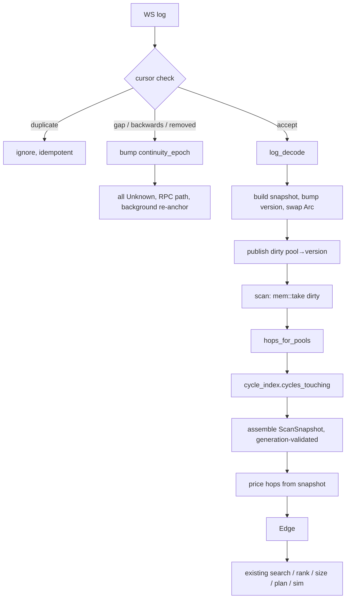

# Live pool state and dirty-route scanning

Date: 2026-08-29 (amended 2026-08-30 with the §1.1 measured baseline)
Status: **Phase 0 merged** (`093c760`); **Phase 1 complete** on `feat/phase1-live-state-shadow`; Phases 2-4 not started
Branch context: merged to `main`; originally `fix/honest-pricing-and-capacity`

Phase 0 found four faults, not one, each of which alone made the subscription
look like a quiet market: fabricated topic constants, a lossy dirty drain, hint
tokens polluting the pool set, and — the one that survived the first fix — a
UniV2-only filter over a monitored set that is entirely Solidly. A fifth,
`PoolMonitor` built with `metrics: None`, made the exit gate itself unable to
report. See §2 and §2.1.

## 1. Problem and scope

The scan re-prices the whole graph every block. `populate_edges` RPC-quotes the
pool inventory, then Bellman-Ford (or the hub-anchored walk) rediscovers graph
*structure* that is nearly static. Structure changes when the pool universe
changes; state changes every block. Only state needs per-scan work.

**The cost is entirely in the quoting, not the search — see §1.1.** That was
assumed when this spec was first written and is now measured, and it changes
what each phase is worth.

This design replaces the **discovery layer** with:

1. Live pool state held in memory, updated from decoded logs.
2. A dirty set of pools whose state moved.
3. Re-pricing bounded to the cycles that traverse those pools, priced from
   local state with no RPC in the hot loop.

### In scope

- UniV2 / Solidly (`Sync`).
- Concentrated liquidity: Uniswap V3, Aerodrome Slipstream, PancakeSwap V3
  (`Swap`, `Mint`, `Burn`).

### Explicitly out of scope for this phase

- **Balancer and Curve.** They keep their existing RPC collectors. They are
  additionally *not present* in `pool_universe()` (`main.rs:5121`), so cycles
  through them are absent from the cycle index. See §9.3 — this is a coverage
  hazard, not a minor gap.
- `Edge`, `Graph`, sizing, the plan builder, REVM simulation, risk policy, the
  executor, rotation, fee accounting. All unchanged.
- Flashblock ingestion itself. The continuity protocol is designed to accept a
  flashblock cursor (§4.4), but this phase runs on `subscribe_logs`.

### Non-goals

- Convex joint optimisation (the `arXiv:2204.05238` formulation). This design
  produces the *active subgraph* that such a solver would consume, but does not
  implement it.
- Any change to how a candidate is sized, simulated, or executed beyond the
  staleness guards in §6.

### 1.1 Measured baseline (2026-08-30, Base, shadow mode)

Taken from a live run once `SHADOW_MODE=true` lifted the wallet-balance gate
that had been aborting every scan before `populate` — until then `scan_ms`
measured only the cost of bailing out, and no full scan had ever executed.

| Stage                                               | Mean           | Share   |
| --------------------------------------------------- | -------------- | ------- |
| `stage="quote"`                                     | **22,645 ms**  | ~67%    |
| `stage="search"`                                    | **5.7 ms**     | ~0.017% |
| unattributed (sizing, sim, liquidity, native price) | ~11,000 ms     | ~33%    |
| **full scan**                                       | **~33,700 ms** |         |

For scale: Base flashblocks are 200ms and blocks are 2s, so a scan completes
against state roughly **17 blocks stale**.

**Quoting costs ~4,000x what the search costs.** Three consequences:

1. Getting RPC quoting out of the hot loop (Phases 1-2) is the only change that
   moves scan latency. It is worth ~22.6s.
2. Bounding the search by the dirty set (Phase 3) is worth ~5.7ms. It remains
   worth building — it is what protects coverage correctness and what the
   Balancer/Curve guard in §9.3 depends on — but **it is not a latency
   optimisation and must not be scheduled as one.**
3. The ~11s unattributed to either stage is larger than anything Phase 3 can
   save. Instrument it before optimising it.

Method note: 5 completed scans over 3m17s. A small sample, and quote cost will
vary with pool count and RPC health — but the ratio is four orders of
magnitude, far outside anything sample size explains.

## 2. Prerequisite: the log subscription matches nothing

`TOPIC_SYNC` and `TOPIC_SWAP` in `ingestion.rs:29-37` are both wrong. Each has a
correct prefix and a fabricated tail.

| Constant     | In code           | Logs on Base | Correct value     | Logs on Base   |
| ------------ | ----------------- | ------------ | ----------------- | -------------- |
| `TOPIC_SYNC` | `0x1c4168cd…f805` | 0            | `0x1c411e9a…bad1` | 6 in one block |
| `TOPIC_SWAP` | `0xd78ad95f…5c01` | 0            | `0xd78ad95f…d822` | 2 in one block |

Verified two ways: `cast keccak` of each event signature, and `eth_getLogs`
against live Base at blocks `0x303afcb` / `0x303afd2`. No test covers either
constant.

Consequences, all mechanical from `.topic0(vec![TOPIC_SYNC, TOPIC_SWAP])` at
`ingestion.rs:170`:

- `handle_log` has never fired. `touched_pools` has never been populated from
  the WS stream.
- `metrics.ingestion_ws_events` is flat at zero — the field check for this.
- The `"pool monitor websocket connected"` log at `ingestion.rs:176` is true and
  misleading: subscribed, but deaf.
- `is_out_of_order` gap detection (`ingestion.rs:218`) never runs.
- Pool state is refreshed *only* by the interval poller. The system is
  pure-polling today regardless of what the logs say.

**Phase 0 fixes this as a standalone change**, before any of the work below.
Constants move to `log_decode.rs` and are derived from their signatures, with a
test asserting each against keccak.

### 2.1 Two adjacent defects, fixed in the same phase

**Token addresses in a pool set.** `main.rs:6427-6428` inserts `hint.from` and
`hint.to` into the touched-pool set, but those are *tokens* (`mempool.rs:30`);
`post_state_from_hint` sets `pool: Address::zero()`, so hints carry no pool
identity at all. Tokens never match a pool, but they make `touched_pools`
non-empty, which flips `populate` to `incremental`, sets `pool_filter` to those
tokens, and `venues.rs:1984` then filters CL `source_pools` to nothing. Any
mempool hint currently produces a scan with zero CL re-quotes and every cached
edge reused.

Fix: resolve the hinted token pair to pools via a new
`PoolUniverse::pools_for_hop` — the inverse of the existing `hops_for_pools`.
`touched_pools_from_hints` (`backrun_state.rs:106`) has the identical defect and
is `#[allow(dead_code)]`; delete it rather than fix it. Its name is the bug.

**Lossy drain.** `drain_touched` (`ingestion.rs:121`) collects into a set and
then calls `clear()`. Any insert landing between the iteration and the clear is
destroyed permanently. Superseded by the version protocol in §4.1.

These are latent today precisely because the topic bug keeps the set empty.
Fixing the topics without fixing these would activate them.

## 3. Architecture

Three new modules, each with one responsibility.

### 3.1 `src/log_decode.rs` — pure decoding

No I/O, no async, no state. Topic constants derived from signatures.

**Dispatch on `topic0`, never on the venue label** (amended 2026-08-30). A log
is self-describing: `0xcf2aa508` *is* a Solidly `Sync` whatever any inventory
claims. Venue labels are not trustworthy — sampling
`data/base/aerodrome_slipstream/pools.jsonl` against Base found 4 of 8 pools
answering `getReserves()`/`stable()` and reverting `slot0()`, i.e. Solidly V2
pairs filed as CL. Under label dispatch those pools would be handed the CL
decoder, never decode, and sit permanently untrusted — safe by §4.3, but Phase 1
would silently deliver a fraction of its coverage with no signal separating that
from quiet pools. Topic dispatch is simpler and immune to inventory drift.

That specific contamination was fixed on 2026-08-30 (§10), but the argument is
not weakened by the fix — it is the reason to keep topic dispatch. Inventories
are rebuilt by scrapers whenever a venue is added, so a verified-clean file is a
snapshot, not a guarantee. Dispatch that cannot be wrong by construction costs
nothing; dispatch that depends on a file staying correct has to be re-earned
after every rebuild.

Functions are `&Log -> Option<Delta>`:

- `decode_v2_sync` — both reserves, exact and complete.
- `decode_cl_swap` — keyed on topic. UniV3 and Slipstream share
  `0xc42079f9…`, **confirmed on Base**: six Slipstream pools plus one UniV3
  pool emitted it in a single block, so ONE decoder covers both venues. Payload
  verified as five words: `amount0`, `amount1`, `sqrtPriceX96`, `liquidity`,
  `tick`. PancakeSwap V3's `0x19b47279…` is still **unverified** — see §10; do
  not write that decoder until a real log confirms the layout.
- `decode_cl_mint` / `decode_cl_burn` — tick range and liquidity delta, for
  ladder maintenance.

Testable from fixture logs with no provider. This is where the Phase 0 bug
would have been caught, and why the constants live here rather than in
`ingestion.rs`.

### 3.2 `src/live_state.rs` — the store

Owns `v2: DashMap<Address, Arc<V2Snapshot>>` and
`cl: DashMap<Address, Arc<ClSnapshot>>`. Snapshots are **immutable**; an update
builds a new one and replaces the `Arc`. A hot-path read is one shard-local
`get` plus an `Arc::clone` — no broad runtime lock, no await, and no lock held
during pricing. `arc-swap` is already a dependency if per-entry lock-free
replacement is wanted later; it is not required for this phase.

Each snapshot carries:

| Field                   | Purpose                                               |
| ----------------------- | ----------------------------------------------------- |
| `state_version: u64`    | monotonic per pool, bumped on every accepted update   |
| `anchor_id: u64`        | identity of the RPC anchor this lineage descends from |
| `continuity_epoch: u64` | global epoch at time of application                   |
| `trust: TrustState`     | see §4.3                                              |
| `drift_events: u32`     | balance-affecting events since anchor (CL only)       |
| `ordinal: Ordinal`      | cursor position of the log that produced it           |

`ClSnapshot` additionally holds the `TickLadder`, and tracks `balance0`/
`balance1` as running deltas — these are not present in any log, and
`cl_sim.rs:35-49` documents them as the only sound capacity source, so the
drift budget in §4.3 exists specifically to bound their error.

**The dirty set lives here**, as `dirty: StdMutex<HashMap<Address, u64>>`
mapping pool to highest published version. It is owned by the writer so the
ordering in §4.1 can be guaranteed. `LiveState` is `Arc`'d on the `Runner`
alongside `cycle_index`.

### 3.3 `src/state_gate.rs` — state honesty

Deliberately mirrors `ParityGate`'s shape: `trusted(pool)` failing closed,
`record(pool, Option<i64>)` where `None` means "no measurement" rather than
"fine", TTL'd verdicts, `due_for_check` bounded per scan.

What it measures is different. `ParityGate` asks *is the math right given the
state* — multi-tick model versus the pool's own quoter. `state_gate` asks *is
the state right at all* — log-derived snapshot versus a fresh RPC read. These
are unrelated failure modes with different causes, fixes, and TTLs, which is
why they stay separate gates.

### 3.4 Wiring, and what is removed

- `PoolMonitor::run_ws` gets the corrected filter, CL pool addresses in its
  address list, and CL topics in `topic0`. Per log it calls
  `live_state.apply_log(...)`. It **no longer calls `refresh_pair`** — that
  per-log RPC round trip is precisely what this design removes.
- `refresh_pair` survives strictly as the recovery/anchor mechanism.
- `handle_log`'s `is_out_of_order` check and its `resync.request()` are
  superseded by the cursor in §4.4, which subsumes gap detection and has a
  defined response. The `ResyncSignal` itself remains as the trigger for the
  background re-anchor task.
- `PoolMonitor.touched_pools`, `mark_touched`, `drain_touched` are **removed**.
  `LiveState.dirty` is the single dirty set. `PoolMonitor` becomes
  ingestion-only and maintains no second notion of "touched".
- `populate_edges` takes `Option<Arc<LiveState>>` and branches per pool: a
  locally-trusted pool builds its `Edge` from memory, anything else RPC-quotes
  exactly as today.

## 4. Core protocols

### 4.1 Version protocol and the dirty set

The correctness of bounding the search rests entirely on the dirty set being
lossless. An untouched cycle is skipped on the reasoning that nothing it
depends on moved; one missing update makes that reasoning false and the cycle
disappears silently rather than mispricing loudly.

Write path, in this order:

```
log accepted → build new snapshot → state_version incremented
             → Arc swapped into map → dirty.insert(pool, version)
```

Read path:

```
let batch = std::mem::take(&mut *dirty.lock());
```

A true swap under the lock. An insert landing immediately after belongs to the
next batch and cannot be erased. This is what the current collect-then-clear
does not provide.

**Invariant.** A consumer must never conclude a pool is clean while its observed
version is newer than the version it priced. Established by: state is applied
before publication, so a drained pool's snapshot version is always ≥ its
published version; and publication after a swap lands in the fresh map.

**Coalescing is permitted; erasure is not.** The consumer records the version it
priced each pool at. Dropping a next-batch entry whose version is already
covered is an optimisation, never a correctness requirement. Failing toward
redundant work is the only safe direction.

### 4.2 `ScanSnapshot` generation protocol

Cloning one `Arc` per pool prevents contention but does not by itself yield a
coherent view — updates can land while the set is being assembled. Snapshot
construction therefore uses generation validation:

```
loop {
    let g0 = generation.load();
    let pools = collect required Arc<Snapshot>;
    let g1 = generation.load();
    if g0 == g1 { break ScanSnapshot { scan_version: g0, pools } }
    // else retry
}
```

`generation` is an `AtomicU64` on `LiveState`, bumped by every accepted state
application and by every continuity epoch change. The accepted `ScanSnapshot`
therefore represents one coherent logical state, or the construction retried.
It is never silently mixed.

Retries are bounded; on exhaustion the scan proceeds on the RPC path rather
than on a possibly-mixed view. Degrade, never guess.

**Consequence.** All routes in one scan reference the same `scan_version`. Route
A cannot see pool X at version 101 while route B sees it at 102. Without this,
ranking two cycles against each other is incoherent — they would be priced
against different worlds.

### 4.3 Trust states, reasons, and lineage

```rust
enum TrustState {
    Anchored,
    Derived,
    Stale(StaleReason),
    Diverged { err_bps: i64 },
    Unknown(UnknownReason),
}

enum UnknownReason { NeverAnchored, ContinuityBreak, Reorg, WsUnavailable }
enum StaleReason   { AnchorTtlExpired, DriftBudgetExhausted }
```

Reasons are operational, not decorative: they let the anchor scheduler
prioritise expensive cases and let a divergence cluster be attributed to a
decoder, a missed event, or an RPC timing artefact.

Mapping to the five reasons required at review: `NeverAnchored`,
`ContinuityBreak`, `WsUnavailable` and `Reorg` are `UnknownReason` variants.
The fifth, *validation failure*, is `Diverged { err_bps }` rather than a
`Stale` reason — a pool whose state was measured and found wrong is a different
condition from one whose state merely aged out, it carries a magnitude worth
retaining for diagnosis, and it warrants a forced re-anchor and a warn where
ageing does not.

| State          | Hot search   | Fallback                          |
| -------------- | ------------ | --------------------------------- |
| `Anchored`     | local price  | —                                 |
| `Derived`      | local price  | —                                 |
| `Stale(_)`     | **excluded** | RPC quote in `populate`           |
| `Diverged{..}` | **excluded** | RPC quote, forced re-anchor, warn |
| `Unknown(_)`   | **excluded** | RPC quote                         |

Every non-trusted state falls back to the existing RPC path. **The worst case is
today's behaviour, not a missing edge.** `Stale` is explicitly not a flavour of
`Derived`. `Diverged` means our *tracking* is wrong rather than the pool, so it
stays tradable via RPC while its local state is distrusted.

**Lineage.** `Derived` is trusted only while its ancestry remains continuous
from a valid anchor:

```
Anchored(v100) → Derived(v101) → Derived(v102) → … → Derived(vN)
```

Validity is checked structurally, not by bookkeeping:

```
snapshot.continuity_epoch == current_epoch
  && snapshot.anchor_id == pool_anchor_id
  && snapshot.drift_events <= drift_budget
```

A snapshot descended from a superseded anchor fails the `anchor_id` comparison
automatically, so lineage invalidation is transitive by construction.

### 4.4 Continuity cursor

Chain-wide, not per-pool: a dropped flashblock can touch any pool.

**Flashblock ordering domain** (target):

```
Ordinal = (payload_id, flashblock_index, tx_index, log_index)
```

Transition rules:

- `flashblock_index == 0` starts a new payload.
- Within a payload, indices increase monotonically with no gaps.
- A new `payload_id` must begin at index 0.
- Any missing index, unexpected reset, duplicate, or backwards movement is a
  continuity failure.

**The flashblock envelope is the authoritative continuity clock.** A
`pendingLogs` stream alone cannot prove that no flashblock was missed — absence
of logs is indistinguishable from absence of delivery. The cursor is therefore
reconciled against the `newFlashblocks` envelope stream, with logs attached to
that state sequence.

**Current ordering domain** (this phase, `subscribe_logs`):

```
Ordinal = (block_number, transaction_index, log_index)
```

Same state machine, so flashblock ingestion drops in later without reworking
continuity.

Acceptance:

| Comparison            | Outcome                                               |
| --------------------- | ----------------------------------------------------- |
| strictly greater      | accept                                                |
| equal                 | duplicate — ignore, fully idempotent, no version bump |
| less                  | out-of-order — continuity failure                     |
| index gap / bad reset | continuity failure                                    |
| `log.removed == true` | continuity failure (reorg / dropped preconf)          |

**Continuity failure response.** Marking every pool `Unknown` must not mean
re-anchoring every pool inline; that would destroy the latency objective. The
response is:

1. Bump `continuity_epoch` — a single atomic increment that invalidates every
   extant snapshot in O(1), with no map sweep and no per-pool writes.
2. Local hot-route eligibility drops to zero immediately.
3. The search switches to the RPC-backed path — i.e. today's system.
4. A bounded background task begins re-anchoring.
5. Pools return to `Anchored` progressively as anchors complete.

The searcher stays live in degraded mode while correctness is restored.

### 4.5 Validation never blocks the hot path

The hot path is always:

```
decode → apply state → mark dirty → local price
```

never

```
decode → RPC anchor → price
```

A background validation task owns all re-anchoring: it pulls `due_for_check`
candidates, performs bounded-concurrency RPC reads against its own budget, and
writes back verdicts and anchors. The hot path only calls `gate.trusted(pool)`.

Trust decay falls out of this rather than needing special handling. A failed or
slow anchor writes no verdict, but `anchored_at` keeps ageing, so the pool
crosses into `Stale(AnchorTtlExpired)` on its own and routes to RPC. **Failure
downgrades trust; it never stalls the searcher.**

## 5. Data flow



Cycles *not* touched keep their edges from `populate_cache.cached_edges`, so the
graph remains complete. Only the re-priced subset is bounded.

## 6. Candidate lifecycle and staleness guards

A coherent snapshot can still be obsolete by dispatch time. Every candidate
carries:

```rust
struct StateStamp {
    scan_version: u64,
    continuity_epoch: u64,
    pool_versions: Vec<(Address, u64)>,   // every pool the route depends on
    anchor_ids: Vec<(Address, u64)>,
}
```

The guard verifies **both** that the epoch is unchanged **and** that every
required pool version is unchanged. Epoch alone catches global continuity
failure but not ordinary state movement; versions alone catch movement but not
a lineage invalidation. Both are required.

### 6.1 Three checkpoints

```
local price
  → CHECK 1 → eth_simulateV1
  → CHECK 2 → sign
  → CHECK 3 → submit
```

A successful simulation does not imply a valid submission: simulation itself can
consume enough time for another flashblock to invalidate the route. Each failed
check cancels the candidate, increments
`candidate_cancelled_stale_total{site}`, and re-prices from the newest snapshot.

### 6.2 Compile-time enforcement

A test can prove the check works. It cannot prove the check is *called* on every
future code path, and that is the failure that actually occurs. So the guard is
structural:

```rust
pub struct VersionChecked<T>(T);          // field private to the module

impl CandidatePlan {
    pub fn verify_current_state(self, live: &LiveState)
        -> Result<VersionChecked<CandidatePlan>, StaleCandidate>;
}

fn submit(plan: VersionChecked<CandidatePlan>) -> …;
```

Constraints on the API:

- The constructor is **private**. `verify_current_state` is the only way to
  obtain a `VersionChecked`.
- No `Deref`, no `into_inner`, no `From`. Recovering an unchecked candidate is
  possible only through an explicit revalidation path.
- Simulation and submission accept `VersionChecked` only.

Forgetting the gate becomes a compile error rather than a missing test.

## 7. Failure modes

| Failure                         | Detection                           | Response                                        |
| ------------------------------- | ----------------------------------- | ----------------------------------------------- |
| Missed log / dropped flashblock | cursor gap, envelope reconciliation | epoch bump, RPC path, background re-anchor      |
| Replayed log                    | cursor equal-or-less                | ignored; version, state and dirty set unchanged |
| Reorg / dropped preconf         | `removed == true`                   | continuity path                                 |
| Balance delta drift             | drift budget, gate divergence       | `Stale(DriftBudgetExhausted)`, anchor           |
| Decoder bug on one venue        | divergence clustered by venue       | `Diverged`, RPC fallback, warn                  |
| WS dies                         | `ws_connected`                      | pools age to `Stale`, RPC path carries          |
| Gate cannot reach RPC           | `record(None)`                      | no verdict written; TTL ages pool to `Stale`    |
| Snapshot generation churn       | retry exhaustion                    | scan proceeds on RPC path                       |

Every response degrades toward the current RPC system. No failure produces a
missing edge or a silently stale price.

## 8. The five invariants and how they are proven

### I1 — no state update can be silently lost

*Mechanism:* §4.1. Apply-then-publish ordering; `mem::take` swap under the lock.

*Proof:* a `loom` model (new dev-dependency) exploring all interleavings of
writers against a consumer. The assertion is about **absence of lost versions**,
not presence of dirty entries:

> every `state_version` published by `apply` is eventually represented by
> either a dirty batch at version ≥ it, or a later processed snapshot at
> version ≥ it.

This phrasing permits coalescing and redundant processing while forbidding
erasure of the newest transition. The model includes **multiple writers** even
though production has one logical ingestion writer, so the store stays correct
if venue streams are parallelised later.

*Supporting:* a stress test (N writers × M updates, union drained ⊇ union
published) as a CI smoke check; an ordering test asserting a drained pool's
snapshot version is never behind its published version.

### I2 — no incoherent snapshot can enter route pricing

*Mechanism:* §4.2 generation protocol.

*Proof:* a test that forces a pool update **during** snapshot construction and
asserts the result is either coherent or retried — never mixed. A second test
asserts that two routes sharing a pool within one `ScanSnapshot` observe
identical versions. A third asserts retry exhaustion falls back to the RPC path
rather than accepting a mixed view.

### I3 — no stale candidate can reach submission

*Mechanism:* §6. Three checkpoints, both epoch and per-pool versions,
`VersionChecked` with a private constructor.

*Proof:* compile-time for the call-site obligation. Behavioural tests: a bump
between pricing and check 1 cancels; a bump between checks 1 and 2 is caught by
check 2; a bump between checks 2 and 3 is caught by check 3; an unchanged state
passes all three and reaches submit; an epoch bump with unchanged pool versions
still cancels; a pool version bump with unchanged epoch still cancels.

### I4 — no continuity-broken pool can be locally trusted

*Mechanism:* §4.3 lineage checks, §4.4 epoch invalidation.

*Proof:* `fn may_price_locally(TrustState) -> bool` written as a `match` with
**no wildcard arm**, so adding a trust state without deciding its policy fails
to compile. Tests: a gapped log stream bumps the epoch and reports every pool
`Unknown(ContinuityBreak)`; after a break, `populate` still yields a non-empty
edge set with RPC provenance — degradation, not disappearance; a `Derived`
lineage whose anchor is superseded becomes untrusted in one operation with no
per-pool sweep; drift-budget exhaustion flips `Derived → Stale`; a duplicate log
leaves version, state and dirty set byte-identical; `removed == true` takes the
continuity path.

### I5 — dirty-route search produces no economically material misses

*Mechanism:* §9.3 comparator, extended well beyond cycle counts.

*Proof:* `ARBOT_CYCLE_INDEX_COMPARE` compares, per scan, the dirty-bounded
result against the full-search comparator on **all** of:

- cycles found
- profitable cycles found
- top-N expected EV
- top-N route identities
- candidate submission eligibility
- gross and net opportunity delta

"Zero misses" is **not** defined as an equal cycle count. A dirty-route
optimisation can return the same count while missing the highest-value route,
which is the failure this criterion exists to catch.

## 9. Rollout

| Phase                        | Flag                      | Gate to advance                                                                     |
| ---------------------------- | ------------------------- | ----------------------------------------------------------------------------------- |
| 0 · topic fix + §2.1 defects | none                      | `ingestion_ws_events` > 0 on Base                                                   |
| 1 · decode + state, shadow   | `ARBOT_LIVE_STATE_SHADOW` | per-venue p99 `relative_delta_bps` ≤ 5, over ≥ 24 h continuous                      |
| 2 · local pricing, per pool  | `ARBOT_LIVE_STATE`        | ≥ 90 % of quoting pools `Anchored`/`Derived`; no venue-clustered `Diverged`         |
| 3 · bound search by dirty    | `ARBOT_DIRTY_SCAN`        | §8 I5 satisfied over ≥ 24 h continuous                                              |
| 4 · flashblock cursor        | —                         | cursor reconciles against `newFlashblocks` with zero unexplained breaks over ≥ 24 h |

Thresholds are proposed defaults, tunable by the operator. The 5 bps figure
matches `ARBOT_CL_PARITY_MAX_ERR_BPS` deliberately, so the state gate and the
existing parity gate cannot disagree about what "passing" means.

Phase 1 is measure-only: local state is computed, compared against the RPC
path, and discarded. This is the same shape as `ParityGate` and the cycle-index
comparator, both of which earned trust that way.

### 9.0 Plan decomposition

Phases 0–4 are too much for one implementation plan and will be sequenced as
three:

1. **Plan A — Phase 0.** The topic fix and the two §2.1 defects. Self-contained,
   independently valuable, and a genuine production bug fix whose blast radius
   is unrelated to the redesign. Ships first and alone.
2. **Plan B — Phases 1 and 2.** The three modules, the version and continuity
   protocols, the staleness guards, shadow rollout, then per-pool local pricing.
   The bulk of the work.
3. **Plan C — Phase 3.** Bounding the search, the extended comparator, and the
   Balancer/Curve guard. Separable, and gated on Plan B's evidence.

**Plan B carries essentially all of the latency benefit** (~22.6s of a ~33.7s
scan; see §1.1). **Plan C is a correctness and coverage change worth ~5.7ms**,
and should be justified on those grounds alone: it is what makes the search
provably complete over the dirty set, and §9.3's guard against silently
dropping Balancer/Curve cycles lives there. Sequencing B before C is right, but
for dependency reasons, not because C is the smaller speedup — C is not a
speedup at all.

If schedule pressure forces a cut, cut Plan C, not the §8 invariants inside
Plan B. The invariants are what make local pricing safe to trust; Phase 3 only
decides how much work is skipped once it already is.

Phase 4 is not planned here: it depends on flashblock ingestion, which does not
exist yet. The cursor abstraction in §4.4 is what keeps that a drop-in rather
than a rework.

### 9.1 Phase 1 reconciliation record

Emitted per pool per check, so divergence can be attributed rather than merely
observed:

| Field                 | Purpose                             |
| --------------------- | ----------------------------------- |
| `local_state`         | log-derived snapshot                |
| `rpc_state`           | fresh anchor read                   |
| `absolute_delta`      | raw difference                      |
| `relative_delta_bps`  | normalised, comparable across pools |
| `local_state_version` | which update produced it            |
| `anchor_id`           | which lineage it descends from      |
| `continuity_epoch`    | whether a break intervened          |
| `trust_state`         | what policy applied at the time     |
| `venue`               | for clustering                      |

Attribution: a decoder bug clusters by venue; a missed event shows a version gap;
an anchoring issue shows a stale `anchor_id`; an RPC/state timing artefact shows
a small `relative_delta_bps` that resolves on recheck.

### 9.2 Metrics

`live_state_divergence_bps` (histogram, by venue), `live_state_trust` (gauge by
state and reason), `continuity_breaks_total` (by reason), `dirty_pools_per_scan`,
`cycles_repriced_per_scan` vs `cycles_total`, `candidate_cancelled_stale_total`
(by check site), `anchor_lag_seconds`, `snapshot_retries_total`.

The selectivity pair (`cycles_repriced_per_scan` vs `cycles_total`) shows how
much work Phase 3 skips; `compare_cycle_index` already logs `touched` for
exactly this. Read it as a **coverage** measure, not a latency one — per §1.1
the search it bounds costs 5.7ms, so a high skip ratio is evidence the index is
selective, not evidence the scan got faster.

Add a scan-latency breakdown alongside these: `stage_latency_ms` already covers
`quote` and `search`, but ~33% of scan time (§1.1) falls outside both. Phase 1
cannot be judged without knowing whether removing 22.6s of quoting exposes a
new bottleneck in that unattributed third.

### 9.3 The Balancer/Curve coverage guard

`pool_universe()` (`main.rs:5121`) reads only univ2, univ3, slipstream and
pancakeswap. Balancer and Curve pools are **absent from the cycle index**, so
bounding the search by `cycles_touching` would drop every cycle through them —
including the ~$15M OETHb/WETH Curve pool in `config/curve.base.json5`.

**Phase 3 must keep cycles containing a Balancer or Curve hop permanently
eligible for the RPC-backed path**, unless and until those venues are explicitly
represented in the dirty-route dependency graph. The optimisation must not trade
away coverage for venues it cannot track. The Curve exposure is exactly the case
this guard protects.

## 10. Open items

- Pancake V3 `Swap` payload layout **still needs confirming** against a live
  Base log before its decoder is written; the two extra trailing fields are
  asserted from the signature, not yet observed. The inventory is now 43 pools,
  up from 28, and every address is factory-confirmed against `0x0BFbCF9f…` as of
  2026-08-30 — so unlike before, a pool drawn from that file is certainly a
  Pancake V3 pool, which the old file could not promise. It is still thin
  (median hub liquidity ~$51k, four pools above $1M), which is why none appeared
  in sampled blocks — widen the window, or query the deepest pool's history
  directly (`0xaaba8e9c…`, ~$119M).
- ~~Slipstream `Swap` assumed identical to UniV3~~ — **confirmed 2026-08-30**:
  Slipstream pools emit `0xc42079f9` with the same five-word payload. `Mint`/
  `Burn` remain assumed-identical and unverified.
- ~~**`data/base/aerodrome_slipstream/pools.jsonl` is ~half Solidly V2 pairs**
  mislabeled as CL (4 of 8 sampled)~~ — **fixed 2026-08-30.** Every Base CL
  inventory is now rebuilt from chain and passes
  `scripts/data/verify_pool_inventory.py --all base`: each record's `factory()`
  matches its declared venue, `token0`/`token1` match the pool's own ordering,
  and `fee` holds tickSpacing for Slipstream venues and the real fee tier for
  UniV3-style ones. Counts moved accordingly — `aerodrome_slipstream` 187 -> 84,
  `aerodrome_slipstream_v3` 177 -> 63, `uniswap_v3` 570 -> 513,
  `pancakeswap_v3` 28 -> 43. **The coverage loss this bullet cited
  (`candidates=187 probed=128`, 59 dropped per cycle) has not been re-measured
  since the fix** — re-run shadow mode before assuming it is gone. Still open:
  the three `aerodrome_slipstream*` inventories remain near-duplicates,
  `aerodrome_slipstream_gauge` (32 records) is declared as a venue in no
  `ops/inputs.yaml` entry and so can be quoted by nothing, and at least two
  actively-trading CL pools (`0xfcce67a1…`, `0xe36596c7…`) appear in no
  inventory at all.
- Drift budget for CL balances needs a measured starting value from Phase 1
  reconciliation rather than a guessed constant.
- **Phase 1 does not subscribe the whole graph, and its measured count is now
  stale.** The field run recorded **683 pools subscribed**, up from 23 — but
  that was measured on 2026-08-30 against the PRE-repartition inventories.
  `da8efd0` has since changed them materially (`aerodrome_slipstream` 187 -> 84,
  `_v3` 177 -> 63, `_gauge` 177 -> 32, `uniswap_v3` 570 -> 513,
  `pancakeswap_v3` 28 -> 43), so **683 no longer describes the current
  configuration and must be re-measured** before it is quoted anywhere.
  The structural point survives the churn: `hot_univ3_pools` and
  `hot_slipstream_pools` hold the ranked HOT subset, not the full inventories,
  so the cold tail has no event source whatever the counts are. Do not read
  Phase 1 as "CL is covered".
- **A rebuilt pool list can silently drop sticky pools.** Observed live: the
  subscription connected with 683 pools (pre-repartition count) and reverted to
  23 after five minutes,
  because the univ2 hot-pool refresh calls `set_pools` with a set rebuilt from
  scratch. Fixed structurally (`PoolMonitor::with_sticky_pools`), but any future
  caller that constructs a monitored set from one source must be checked against
  this.
- `loom` as a dev-dependency is a new dep. If declined, the fallback is a
  `std::sync::Barrier` forcing the known interleaving plus the stress test —
  which proves the one race we thought of, not the absence of races.
- **The ~11s unattributed to `quote` or `search` (§1.1) is uninvestigated** and
  is larger than anything Phase 3 saves. Instrument sizing, simulation,
  liquidity and native-price stages before assuming Phase 1 alone gets the scan
  near block cadence.
- **The websocket covers 23 of ~726 Base pools (3.2%).** `PoolMonitor` watches
  only constant-product pools; 703 CL pools (513 univ3, 84+63 slipstream, 43
  pancake) have no event subscription at all and enter the dirty set only via
  the `max_quote_block_lag` sweep. Counts restated 2026-08-30 after the
  inventory repartition above; the ratio improved only because contaminated
  records were removed, not because coverage grew. Closing that is the
  substance of Phase 1, and the pool-count asymmetry is why quoting dominates.
- `POOL_MONITOR_POLL_MS` (1200) and `POOL_MONITOR_STALE_MS` (defaults to
  `poll x 3` = 3.6s) are inherited defaults, not choices. They were harmless
  while the poller took 13.8s per cycle only because everything was stale
  anyway; after `093c760` the cycle is ~0.5s. Phase 1 makes staleness a trust
  state, so both values become load-bearing and should be set deliberately.
